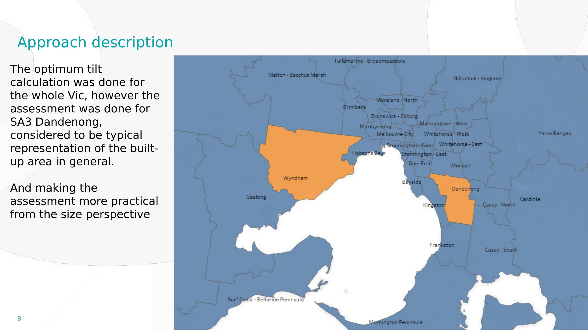
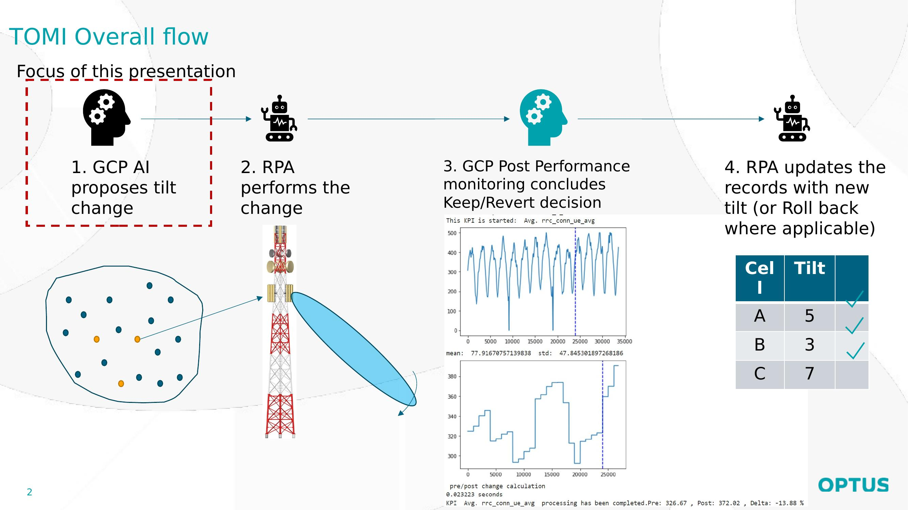
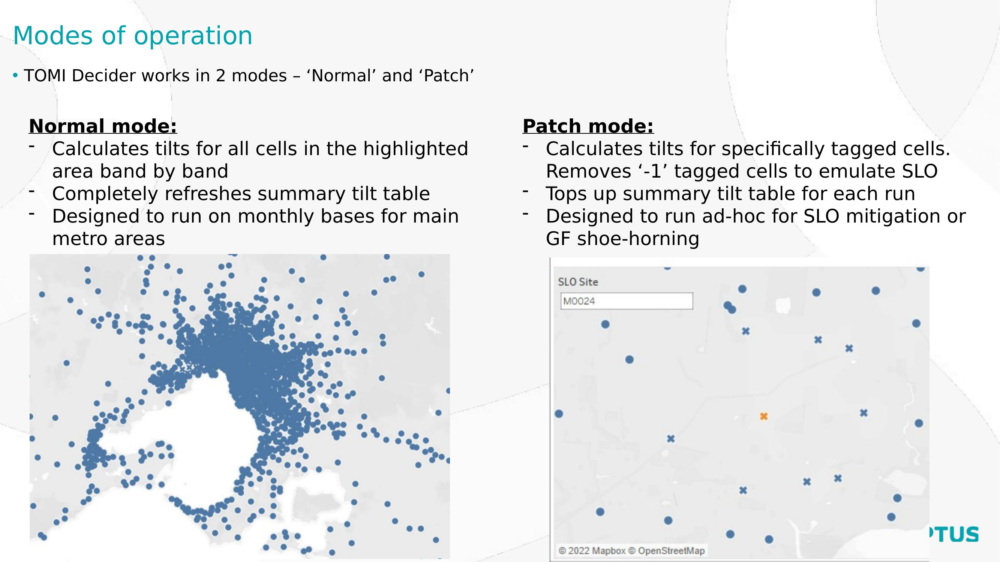
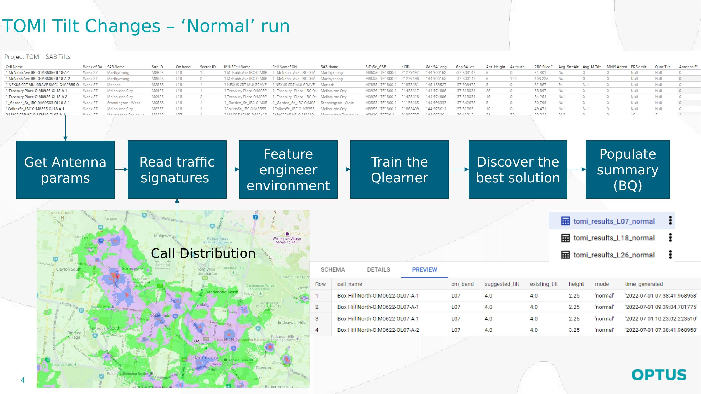
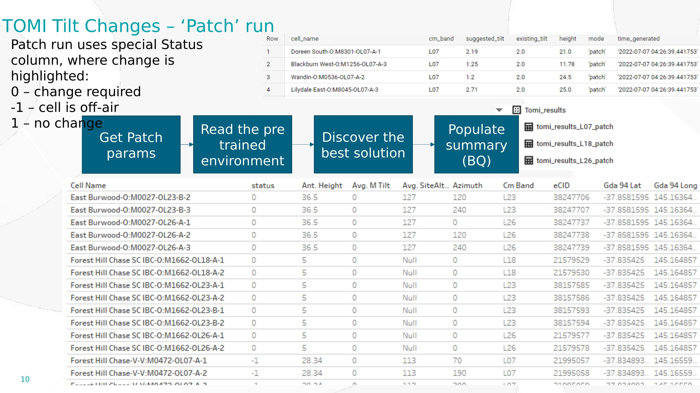
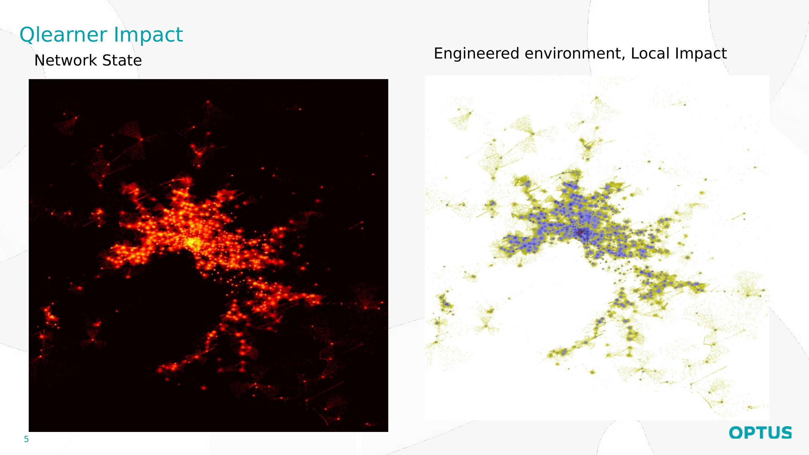
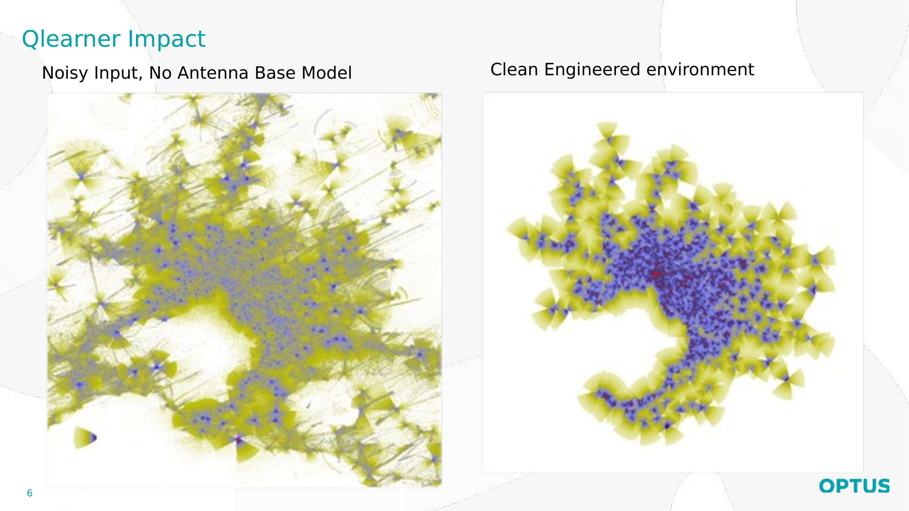
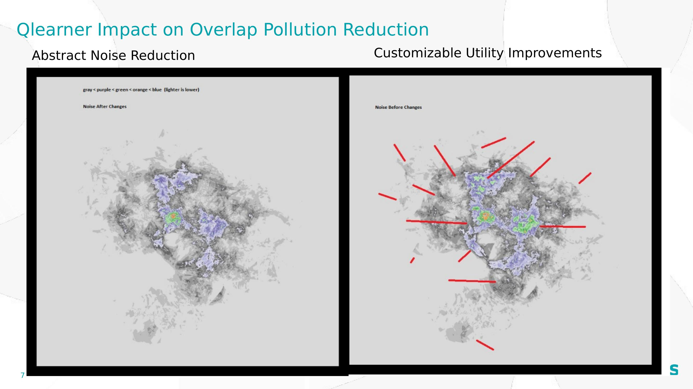
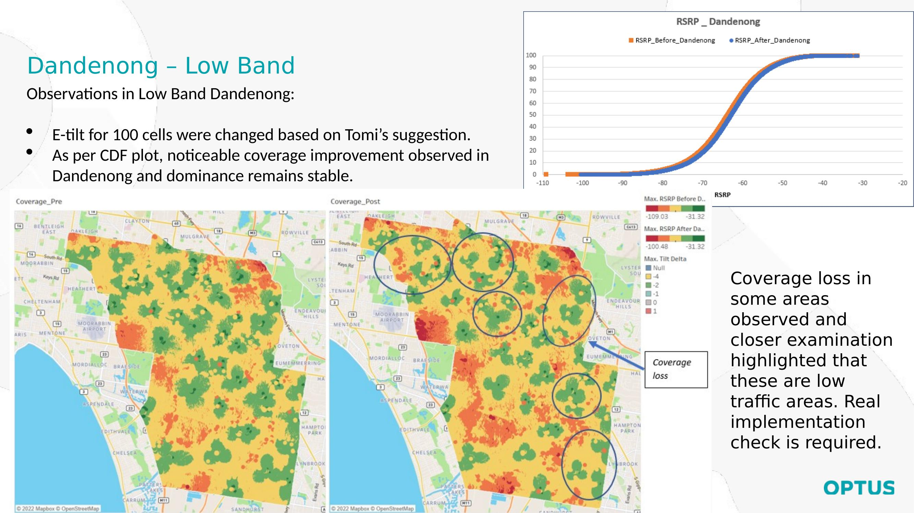
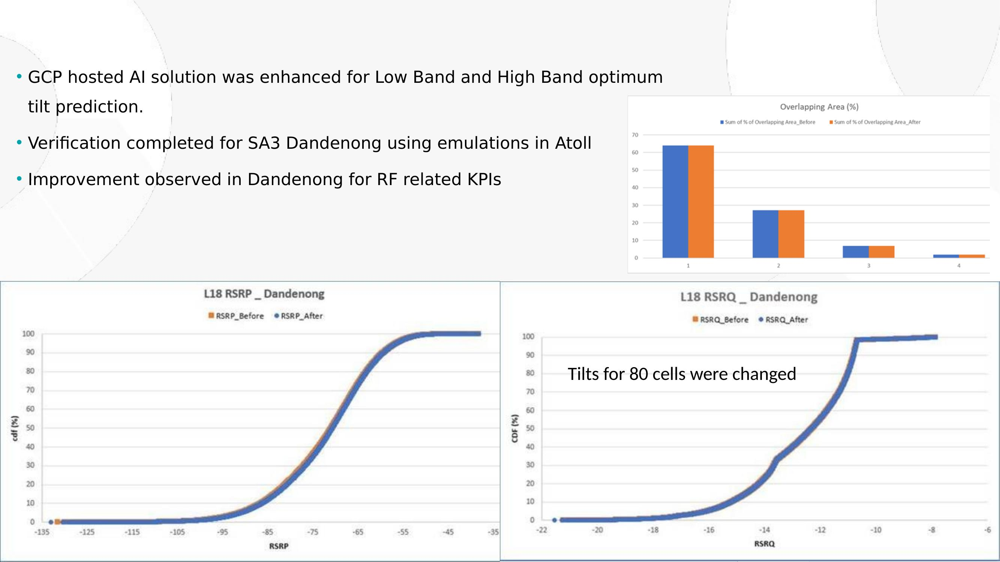

# TOMI: Topology Optimization through Machine Intelligence

## A Reinforcement Learning Framework for Automated Antenna Tilt and Azimuth Optimization in LTE Networks

### Whitepaper Brief

---

## Abstract

Mobile network operators face a persistent challenge: optimizing the physical configuration of thousands of antennas to maximize signal quality, minimize interference, and maintain seamless coverage across diverse geographic environments. Conventional approaches rely on manual drive testing, expert judgment, and rule-based planning tools — methods that scale poorly with network density and cannot adapt to changing traffic patterns.

TOMI (Topology Optimization through Machine Intelligence) addresses this through a reinforcement learning framework that learns optimal antenna tilt and azimuth configurations directly from network measurement data. The system combines a deep Q-learning agent with a CNN-based propagation model, a local hill-climbing refinement stage, and a post-performance monitoring pipeline that validates changes against real-world measurements.

This paper describes the TOMI architecture, its novel adaptive SINR/RSRQ reward formulation that automatically adjusts optimization strategy between interference-limited and noise-limited environments, the integration of open-source terrain and clutter data into the learned propagation model, and results from deployment in the Melbourne metropolitan LTE network across 700 MHz (L07), 1800 MHz (L18), and 2600 MHz (L26) frequency bands.

---

## 1. Introduction

### 1.1 The Antenna Optimization Problem

A modern metropolitan LTE network comprises thousands of antenna sectors, each defined by physical parameters — electrical tilt, mechanical tilt, azimuth, height, and transmit power. These parameters collectively determine the coverage footprint, interference geometry, and user experience across the entire service area.

The configuration space is enormous. A network of 1,000 sectors, each with 10 possible electrical tilt settings and 36 possible azimuth orientations, has 360,000 possible single-antenna changes and a joint configuration space of (10 × 36)^1000 — a number that renders exhaustive search impossible. Furthermore, antenna parameters are coupled: adjusting one sector's tilt changes the interference experienced by every neighboring sector, which changes their optimal configurations in turn.

Traditional optimization approaches include manual expert planning (slow, expensive, doesn't scale), rule-based heuristics (fast but unable to capture complex interactions), and commercial planning tools like Atoll and Planet (require detailed propagation models and extensive calibration). None of these approaches learn from the network's own measurement data or adapt automatically as the network evolves.

### 1.2 TOMI's Approach

TOMI formulates antenna optimization as a reinforcement learning problem:

- **State:** A spatial representation of the current coverage and interference landscape across a 1024×1024 grid covering the geographic area of interest
- **Actions:** Discrete adjustments to individual antenna tilt and azimuth parameters
- **Reward:** An adaptive signal quality metric that blends SINR and RSRQ based on local interference conditions, weighted by population density and penalized for excessive cell overlap
- **Transition model:** A learned CNN propagator that predicts coverage changes from antenna parameter adjustments

The agent learns which tilt and azimuth adjustments improve network quality by interacting with the environment — initially through exploration, eventually through learned policy. A local hill-climbing stage refines the global RL recommendations, and a post-performance monitoring (PPM) pipeline validates every change against real UE measurements.

### 1.3 Key Contributions

1. **Adaptive SINR/RSRQ reward function** that automatically weights interference-based (SINR) and measurement-based (RSRQ) quality metrics per grid location, enabling a single system to optimize across urban, suburban, and rural environments without manual configuration.

2. **Learned CNN propagation model** that discovers propagation characteristics from data, augmented with open-source terrain and clutter features (SRTM elevation, OpenStreetMap buildings, Sentinel-2 vegetation) as static input channels.

3. **Operationally constrained action space** that separates electrical tilt (remotely adjustable via RET) from mechanical tilt (fixed), ensuring every recommendation is implementable without a site visit.

4. **Closed-loop validation pipeline** using Bayesian before/after testing on SINR and RSRQ KPIs, with automated rollback triggers and neighbor-cell impact monitoring.

5. **Multi-stage optimization** combining deep Q-learning for global exploration with simulated annealing for local refinement, capturing both long-range antenna interactions and fine-grained parameter tuning.

---

## 2. System Architecture

### 2.1 Overview

TOMI operates as a three-stage pipeline:

**Stage 1 — Global Optimization (Deep Q-Learning):** A CNN-based Q-network explores the joint tilt/azimuth configuration space across all antennas in the region. The agent takes individual antenna actions (tilt up/down, azimuth left/right at coarse and fine granularity) and observes the resulting change in the adaptive SINR/RSRQ reward. Over 100,000 iterations with epsilon-greedy exploration, the agent learns a policy that maps environment states to quality-improving actions.

**Stage 2 — Local Refinement (Simulated Annealing):** The Q-learner's best configuration initializes a simulated annealing optimizer that operates on local windows of the network. This stage escapes local optima through probabilistic acceptance of worse solutions at high temperature, converging to precise tilt values at low temperature. Operational constraints (±4° from baseline, RET range limits) are enforced throughout.

**Stage 3 — Validation (Post-Performance Monitoring):** Every recommended tilt/azimuth change is validated against real network measurements. The PPM pipeline tracks SINR and RSRQ distribution percentiles (5th, 50th, 95th) on both the target cell and its neighbors, applies Bayesian before/after testing, and flags changes for rollback if P(degradation) exceeds a threshold. Negative outcomes are fed back into the Q-learner's replay buffer as high-priority training examples.

### 2.2 Spatial Representation

The geographic area is discretized into a 1024×1024 grid, with each cell representing approximately 50m × 50m at Melbourne's latitude. Antenna locations are mapped from GDA94 coordinates to grid indices. The grid resolution provides a balance between spatial fidelity and computational tractability — fine enough to distinguish individual street blocks in urban areas, coarse enough for real-time CNN inference.

The environment state at each grid point is characterized by multiple layers:

- **Serving power (Layer 1):** Best-server RSRP — the maximum received power across all cells at that location. Computed via `np.maximum` across per-antenna coverage footprints.
- **Total power (Layer 2):** Sum of received power from all cells at that location. Computed via `np.sum` of all antenna contributions. The difference between Layer 2 and Layer 1 is the total interference.
- **Overlap count (Layer 3):** Number of cells providing signal above a threshold at that location. Used for the graduated overlap penalty.
- **Population density (Layer 4):** Call distribution data aggregated from network measurements, log-transformed. Ensures the optimizer prioritizes areas where people actually are.

Additionally, four static clutter layers provide geographic context to the CNN:

- **Terrain elevation:** From SRTM at 30m resolution, resampled to the grid.
- **Building density:** From OpenStreetMap building footprints, rasterized as coverage fraction per cell.
- **Building height:** From OSM height tags, gap-filled with GHSL satellite-derived estimates.
- **Vegetation density:** From Sentinel-2 NDVI, or an OSM landuse proxy.

### 2.3 Antenna Model

Each antenna is characterized by:

- **Position:** (x, y) grid coordinates derived from GDA94 lat/long
- **Height:** Antenna height above ground in meters
- **Electrical tilt (e_tilt):** Remotely adjustable via RET, range [0°, −10°]
- **Mechanical tilt (m_tilt):** Fixed, set by physical mounting angle
- **Effective tilt:** Sum of electrical and mechanical tilt, used in the propagation model
- **Azimuth:** Horizontal beam direction in degrees [0°, 360°)
- **Frequency band:** L07 (700 MHz), L18 (1800 MHz), or L26 (2600 MHz)

The separation of electrical and mechanical tilt is operationally critical. Only electrical tilt is modified by the optimizer. This ensures every recommendation is implementable via a remote RET command, without requiring a physical site visit or rigger crew.

The per-antenna coverage footprint is computed by a geometric propagation function (`make_norm`) that models the antenna's radiation pattern as a function of distance, azimuth offset, and elevation angle. The function uses a local-patch optimization — estimating the bounding box of the coverage wedge and computing only within that region (~500×500 pixels instead of the full 1024×1024), yielding a ~4× speedup. The 3D direction vector from the antenna is computed from the effective tilt and azimuth, and the signal strength falls off with distance and angular offset from the main beam. A beamwidth cutoff suppresses contributions outside the main lobe. A `FootprintCache` stores all N footprints and maintains the serving/total/overlap layers incrementally, recomputing only the single changed antenna per training step.

---

## 3. Reward Function Design

### 3.1 Limitations of Coverage-Based Reward

A naive reward function maximizes population-weighted coverage:

```
R = Σ_p serving_power(p) × population(p)
```

This treats every populated location with a strong serving signal as well-served, regardless of interference. Two fundamental failure modes arise:

**Pilot pollution:** A location with three equally strong cells scores well (strong serving power) but delivers terrible user experience because no cell clearly dominates, causing frequent handover failures and high interference.

**Hidden interference:** A tilt change that strengthens the serving cell also strengthens interference to neighboring cells' users. The coverage reward credits the improvement to the served users but cannot see the degradation to the neighbors.

### 3.2 Adaptive SINR/RSRQ Reward

TOMI replaces the coverage reward with an adaptive blend of two complementary quality metrics:

**SINR (Signal-to-Interference-plus-Noise Ratio):**

```
SINR(p) = serving_power(p) / (total_power(p) − serving_power(p) + noise_floor)
```

SINR explicitly separates serving signal from interference. It provides clean optimization gradients for tilt adjustments because the interference term in the denominator responds directly to changes in neighboring antennas' footprints. SINR maps directly to achievable throughput via Shannon capacity: Rate = BW × log₂(1 + SINR).

**RSRQ (Reference Signal Received Quality):**

```
RSRQ(p) = N_RB × RSRP_serving(p) / RSSI(p)
```

RSRQ is a standard 3GPP measurement reported by every UE. Unlike SINR, which must be estimated from the propagation model, RSRQ is directly measurable and comparable across devices and vendors. It serves as the ground-truth validation metric.

**Adaptive weighting:**

The two metrics are blended per grid point based on the local interference regime:

```
α(p) = interference(p) / (interference(p) + noise_floor)

quality(p) = α(p) × log₂(1 + SINR(p)) + (1 − α(p)) × log₂(1 + RSRQ(p))
```

Where interference dominates (α → 1, urban), the reward leans on SINR for its clean interference gradients. Where noise dominates (α → 0, rural), the reward leans on RSRQ for its measurement reliability. The transition is continuous and requires no per-region configuration — the physics of each location determines the balance.

### 3.3 Graduated Overlap Penalty

The overlap component rewards healthy handover zones while penalizing excessive multi-cell interference:

```
overlap_score(p) = 
    0.5   if 0 cells (coverage gap)
    1.0   if 1 cell  (ideal single coverage)
    1.2   if 2 cells (healthy handover zone)
    1.2 − 0.3 × (n − 2)  if 3+ cells (interference penalty)
```

This replaces a binary overlap cap and creates a direct incentive for tilt adjustments that reduce areas with 3+ overlapping cells while preserving handover corridors.

### 3.4 Complete Reward Function

```
R = Σ_p quality(p) × population(p) × overlap_score(p)
```

The reward is normalized as a percentage change from the pre-action value to keep magnitudes bounded:

```
reward = (R_after − R_before) / |R_before|
```

---

## 4. Q-Learning Agent

### 4.1 Network Architecture

The Q-network is a dueling CNN that maps the environment state to Q-values for all possible actions. Two separate encoders process dynamic and static inputs:

**Dynamic encoder** — processes the 8-channel environment state (stacked history frames that change every step) through four convolutional blocks with progressive downsampling:

| Stage | Channels | Spatial | Receptive field |
|-------|----------|---------|-----------------|
| Input | 8 | 1024×1024 | — |
| Block 1 (Conv 5×5, BN, ReLU, MaxPool 4×4) | 32 | 256×256 | ~16 px |
| Block 2 (Conv 3×3, BN, ReLU, MaxPool 4×4) | 64 | 64×64 | ~48 px |
| Block 3 (Conv 3×3, BN, ReLU, MaxPool 4×4) | 128 | 16×16 | ~144 px |
| Block 4 (Conv 3×3, BN, ReLU, MaxPool 4×4) | 128 | 4×4 | ~400+ px |

The ~400-pixel receptive field is critical: it allows the network to see the interference relationship between an antenna and cells several kilometers away on the grid — the fundamental coupling that tilt optimization exploits.

**Static clutter encoder** — processes the 4 clutter channels (terrain, building density, building height, vegetation) through a separate 3-block CNN. Since clutter layers never change, the encoder runs once at startup and caches the output (64 channels at 4×4 spatial resolution = 1,024 features). This saves ~40% of forward pass compute compared to re-encoding clutter on every step.

**Dueling head** — the flattened dynamic features (2,048) and cached clutter features (1,024) are concatenated into a 3,072-dimensional vector, then split into two streams:

- **Value stream** V(s): Linear(3072 → 256 → 1) — how good is this network state overall
- **Advantage stream** A(s,a): Linear(3072 → 256 → n_actions) — how much better each tilt/azimuth action is than the average action

Q-values are reconstructed as: Q(s,a) = V(s) + A(s,a) − mean(A). The advantage-centering ensures V(s) uniquely captures state value. Critically, neither stream has an output activation function — Q-values must be able to go negative to represent harmful tilt actions.

The output dimension equals 8 × n_antennas (8 actions per antenna: fine/coarse tilt up/down, fine/coarse azimuth left/right). The model has approximately 3M parameters in the dueling configuration, versus ~230K in the original flat architecture.

### 4.2 Action Space

Each antenna has 8 possible actions:

| Action | Parameter | Step Size | Bounds |
|--------|-----------|-----------|--------|
| Fine downtilt | e_tilt | −0.5° | [0°, −10°] RET range |
| Fine uptilt | e_tilt | +0.5° | [0°, −10°] RET range |
| Coarse downtilt | e_tilt | −2.0° | [0°, −10°] RET range |
| Coarse uptilt | e_tilt | +2.0° | [0°, −10°] RET range |
| Azimuth left (fine) | azimuth | −1° | [0°, 360°) wraparound |
| Azimuth right (fine) | azimuth | +1° | [0°, 360°) wraparound |
| Azimuth left (coarse) | azimuth | −5° | [0°, 360°) wraparound |
| Azimuth right (coarse) | azimuth | +5° | [0°, 360°) wraparound |

The dual-granularity action space (fine + coarse) enables both rapid exploration of the configuration space and precise final tuning, without requiring an annealing schedule on step sizes.

### 4.3 Training Enhancements

The Q-learning agent incorporates several stabilization techniques:

**Target network:** A separate copy of the Q-network with frozen weights provides stable targets. Weights are soft-updated after each training step with blending coefficient τ = 0.005, giving a smooth tracking of the main network without the oscillation caused by using the same network for both prediction and target computation.

**Double Q-learning:** The main network selects the best action for the next state, but the target network evaluates that action's Q-value. This decouples action selection from action evaluation, eliminating the systematic overestimation bias inherent in the max operator applied to noisy Q-estimates.

**N-step returns (N=3):** Instead of bootstrapping from the Q-estimate after a single step, the agent accumulates 3 steps of observed reward before bootstrapping. This grounds early training in real experience and captures the delayed effects of tilt changes on neighboring cells' interference patterns.

**Experience replay (50K buffer):** Transitions are stored in a circular buffer of 50,000 entries and sampled uniformly for training. This decorrelates consecutive samples and allows the agent to learn from rare but informative transitions (e.g., a tilt change that dramatically improved or degraded SINR).

**Huber loss:** Replaces MSE loss for the Bellman error, providing quadratic sensitivity for small prediction errors and linear sensitivity for large errors. This naturally caps gradient magnitudes during early training when TD errors are large, eliminating the need for manual loss scaling.

---

## 5. Learned Propagation Model with Clutter

### 5.1 Geometric Propagation with Footprint Caching

The base propagation model computes each antenna's coverage footprint from geometry: a 3D direction vector from the antenna's effective tilt and azimuth, distance-based attenuation, and a beamwidth cutoff. Three optimizations make this computationally efficient:

**Local-patch computation:** Rather than computing trig over the full 1024×1024 grid (1,048,576 points), the propagation function estimates a bounding box around the antenna's coverage wedge and computes only within that region (~500×500). This eliminates ~75% of the work since the 22° beamwidth cutoff means most grid points contribute zero signal. An `arccos` numerical stability fix (clamping the argument to [-1, 1]) prevents NaN at the antenna location.

**Batched initialization:** At startup, footprints for all N antennas are computed in parallel using (chunk, H, W) GPU arrays. CuPy parallelizes the trig across the batch dimension, achieving ~20× speedup over sequential computation.

**Incremental cache updates:** A `FootprintCache` stores all N footprints and derives the serving (max), total (sum), and overlap (count) layers. Per training step, only the single changed antenna's footprint is recomputed. The serving layer is rebuilt only in the region where the old or new footprint is nonzero — typically a few percent of the grid.

### 5.2 Open-Source Clutter Integration

The geometric model is augmented with static geographic features derived from freely available data:

**Terrain elevation (SRTM, 30m):** The Shuttle Radar Topography Mission provides global elevation data at 1-arc-second resolution. For the Melbourne grid, this captures hills, valleys, ridgelines, and elevated terrain that create shadow zones and diffraction effects. The CNN discovers that signals aimed downhill from a hilltop antenna propagate further than signals aimed at a ridge.

**Building density (OpenStreetMap):** Building footprints are rasterized at 4× oversampling and averaged to produce a fractional coverage value per grid cell. Melbourne CBD shows 60–80% building density; suburban areas show 10–30%. The CNN learns that coverage footprints shrink in dense building environments compared to open areas with identical antenna parameters.

**Building height (OpenStreetMap + GHSL):** OSM provides explicit height tags for some buildings, with a fallback chain: `height` tag → `building:levels × 3m` → default 6m. The European Commission's Global Human Settlement Layer provides satellite-derived height estimates at 10m resolution for gap-filling. The CNN uses height information to learn that tall building clusters block certain interference paths.

**Vegetation density (Sentinel-2 NDVI):** The Normalized Difference Vegetation Index from 10m Sentinel-2 satellite imagery quantifies canopy density. Dense tree cover at NDVI > 0.6 adds 10–20 dB of propagation loss at 1800 MHz. A fallback proxy derived from OSM landuse tags is available when satellite imagery is not.

These four layers are added as static input channels to the CNN, expanding the input from 8 to 12 channels. The CNN learns the propagation effects of terrain and clutter from data — no hand-coded loss tables are required. The network discovers that tilt adjustments aimed toward dense building clusters produce different results than those aimed toward open parkland, and optimizes accordingly.

### 5.3 Data Preparation Pipeline

A standalone preparation script processes raw open-source data into 1024×1024 numpy arrays aligned to the TOMI grid:

1. The geographic bounding box is extracted from the antenna CSV
2. SRTM elevation is resampled using bilinear interpolation via rasterio
3. OSM building footprints are rasterized at 4× resolution and downsampled for density; heights are parsed from tags and gap-filled with GHSL
4. Sentinel-2 NDVI is resampled or an OSM landuse proxy is generated
5. All layers are normalized to [0, 1] and saved in TOMI's pickle format plus a combined 4-channel numpy array for efficient CNN loading

---

## 6. Local Refinement via Simulated Annealing

### 6.1 Motivation

The Q-learning agent finds good regions of the configuration space but may not converge to the precise optimum due to the discrete action space and the approximation inherent in function approximation. A local refinement stage converts the Q-learner's directional recommendations into precise, operationally implementable tilt values.

### 6.2 Simulated Annealing Optimizer

The local optimizer uses simulated annealing with exponential temperature cooling. Unlike the greedy hill climbing it replaces, simulated annealing accepts worse solutions with probability exp(−Δ/T), enabling escape from the local optima that arise from coupled antenna interactions in dense urban clusters.

Key features:

- **Adaptive step size:** Coupled to temperature — large exploratory steps at high temperature, fine-grained refinement at low temperature
- **Operational bounds:** ±4° from baseline electrical tilt, within the RET range [0°, −10°]
- **Global best tracking:** The algorithm may move away from the best solution found (that is the mechanism for escaping local optima) but separately tracks and returns to the global best at termination
- **Q-learner initialization:** The hill climber starts from the Q-learner's best recommendation, combining global RL exploration with local continuous optimization

### 6.3 Window-Based Decomposition

The full network optimization is decomposed into overlapping local windows, each containing a cluster of interacting antennas. This exploits the locality of antenna interactions — cells primarily interfere with their immediate neighbors, not cells 10 km away. Each window is optimized independently with a shared boundary condition, and the results are stitched together.

---

## 7. Post-Performance Monitoring

### 7.1 Closed-Loop Validation

Every tilt/azimuth change recommended by TOMI is validated against real-world network measurements. The PPM pipeline monitors hourly KPIs for both the target cell and its first-tier neighbors:

- SINR percentiles: 5th (edge users), 50th (typical), 95th (best case)
- RSRQ percentiles: 5th (worst quality), 50th (typical)
- Serving cell average RSRP and RSRQ
- RRC connected users (traffic volume)

### 7.2 Bayesian Before/After Testing

For each KPI, the PPM applies a Bayesian comparison between the pre-change and post-change distributions:

- Sample posterior distributions for pre and post means using conjugate normal priors
- Compute P(improvement) as the fraction of posterior samples where post > pre
- Compute expected lift as the mean of the posterior difference
- Compute a 90% credible interval on the lift

This produces directly interpretable outputs: "94% probability this tilt change improved 5th-percentile RSRQ, with expected lift of +0.3 dB, 90% CI [+0.1, +0.5]."

### 7.3 Neighbor Impact and Rollback

A tilt change that improves the target cell but degrades neighboring cells is a net negative. The PPM evaluates the same KPI set on all first-tier neighbors, catching interference effects that per-cell analysis would miss.

If P(degradation) exceeds 90% for any critical KPI (RSRQ_p5, SINR_p5) on the target cell or any neighbor, the change is flagged for rollback. The negative outcome is injected into the Q-learner's replay buffer as a high-priority training example, creating a feedback loop that improves future recommendations.

---

## 8. Multi-Band Considerations

### 8.1 Frequency-Dependent Propagation

TOMI operates across three LTE frequency bands with distinct propagation characteristics:

**L07 (700 MHz):** Longest range, best building penetration, primarily provides wide-area coverage in suburban and rural areas. Interference-limited scenarios are less common due to larger cell spacing. The adaptive reward naturally shifts toward RSRQ weighting.

**L18 (1800 MHz):** Medium range, the workhorse urban band. Dense deployments create significant inter-cell interference. The adaptive reward heavily weights SINR optimization. Tilt adjustments have the most leverage here — small tilt changes produce large interference geometry changes due to dense cell spacing.

**L26 (2600 MHz):** Shortest range, highest capacity, primarily deployed in dense urban and indoor environments. Propagation is heavily affected by building clutter. Building density and height clutter layers are most impactful for this band.

### 8.2 Per-Band Optimization

Each frequency band is optimized independently, reflecting the physical reality that intra-frequency interference (L18-to-L18) is the primary concern while inter-frequency interference (L18-to-L07) is negligible. The environment state, overlap count, and SINR computation are all band-specific.

However, the clutter layers (terrain, buildings, vegetation) are shared across bands with band-specific attenuation coefficients — vegetation loss at 2600 MHz is roughly double that at 700 MHz.

---

## 9. Deployment Considerations

### 9.1 Computational Requirements

The Q-learning agent trains on GPU (CUDA) with the 1024×1024 environment state processed through the dueling CNN. The primary computational costs are the environment step (local-patch `make_norm` at ~1.2 ms + incremental cache update at ~1.8 ms = ~3 ms total) and CNN forward/backward passes (~2 ms per training step with fp16 autocast).

**GPU requirements:** CuPy requires CUDA — CPU-only training is not viable for the 1024×1024 grids. An NVIDIA T4 (16 GB) is sufficient for single-band SA3 optimization with minibatch size 8, with peak GPU memory of ~3–4 GB. Production metro-wide runs benefit from a V100 (16/32 GB) to support larger minibatches. Full-Australia optimization at minibatch 32 requires an A100 (40/80 GB).

**Memory:** 16 GB system RAM minimum, 32 GB recommended. The replay buffer (50K transitions) is the main consumer at ~8–12 GB resident. Compressed replay or state deltas can reduce this to ~2–4 GB.

**Training time:** 100K iterations on a T4 completes in ~1.5–3 hours with mixed precision and footprint caching; on a V100, ~0.5–1.5 hours; on an A100, under 1 hour. The Generation 3 hill-climbing-integrated approach covers all of Australia within a few hours on a single V100.

**Precision note:** The system uses a three-zone mixed precision architecture: CuPy environment grids at fp64 (numerical sensitivity in arccos/reciprocal computations and million-point sums), CNN model weights at fp32, and CNN forward passes at fp16 via PyTorch's automatic mixed precision (AMP). The `GradScaler` prevents fp16 gradient underflow during backpropagation. This combination achieves 4–6× CNN throughput over fp64 with no loss in optimization quality, making the T4 competitive with a V100 at the original precision.

| Use case | GCP instance | GPU | vCPU / RAM | Cost |
|----------|-------------|-----|------------|------|
| Development / single SA3 | n1-standard-4 | 1× T4 | 4 / 15 GB | ~$1.40/hr |
| Production / metro-wide | n1-highmem-8 | 1× V100 | 8 / 52 GB | ~$3.50/hr |
| Full Australia | n1-highmem-8 | 1× A100 | 8 / 52 GB | ~$5.00/hr |

### 9.2 Integration with Network Management Systems

TOMI's recommendations are expressed as per-antenna electrical tilt and azimuth values, which map directly to RET (Remote Electrical Tilt) commands in the network management system. The PPM pipeline consumes standard hourly KPI exports (PM counters) available from any LTE OSS.

### 9.3 Safety and Rollback

The system implements multiple safety layers:

- Operational bounds enforce maximum tilt deviation from baseline (±4°) and RET range limits
- The PPM validates every change against real measurements before declaring success
- Automated rollback triggers based on Bayesian degradation probability
- Negative outcomes feed back into training, preventing the same bad recommendation twice

---

## 10. Deployment Results: Victoria Metro Network

### 10.1 Scope and Approach

TOMI was deployed for optimum tilt prediction across the Victorian metropolitan LTE network, covering Low Band (L07, 700 MHz), Mid Band (L18, 1800 MHz), and High Band (L26, 2600 MHz). The GCP-hosted AI solution was enhanced for multi-band operation and verified using emulations in Atoll, the industry-standard RF planning tool.

While tilt optimization was computed for the entire Victorian network, the formal assessment focused on **SA3 Dandenong** — a Statistical Area Level 3 region in Melbourne's south-east considered to be a typical representation of built-up suburban/urban areas. This scoping made the assessment practical from both a size perspective and a representativeness perspective: Dandenong contains a mix of dense commercial corridors, residential suburbs, and lower-density fringe areas that exercise different aspects of the optimizer.



*Geographic scope. Tilt optimization was computed for the full highlighted region (all of metro Victoria), with detailed assessment on SA3 Dandenong. The region covers a diverse mix of urban density, suburban residential, and semi-rural fringe.*

### 10.2 Operational Flow

The deployed system operates as a 4-step closed loop:

1. **GCP AI proposes tilt change** — the Q-learner and hill climber generate per-cell e-tilt recommendations
2. **RPA performs the change** — Robotic Process Automation executes the tilt adjustment via RET command on the live network
3. **GCP Post Performance Monitoring concludes Keep/Revert decision** — the PPM pipeline analyzes hourly KPIs across a 2-week window, comparing pre-change and post-change distributions
4. **RPA updates records** — confirmed tilts are recorded in BigQuery; degraded tilts are rolled back



*The 4-step operational loop from AI recommendation through RPA execution, PPM validation, and record update. The PPM output shows actual `rrc_conn_ue_avg` time series for a cell, with the change point marked by the vertical dashed line. Pre/post statistics are computed automatically (Pre: 326.67, Post: 372.02, Delta: −13.88%).*

The system operates in two modes:

**Normal mode** computes tilts for all cells in the highlighted area, band by band. It completely refreshes the summary tilt table and is designed to run monthly for main metro areas. The pipeline reads antenna parameters, ingests call distribution data, feature-engineers the environment, trains the Q-learner, discovers the best solution, and populates BigQuery results tables (one per band: `tomi_results_L07_normal`, `tomi_results_L18_normal`, `tomi_results_L26_normal`).

**Patch mode** computes tilts for specifically tagged cells only. Cells tagged with status `0` require change, `-1` indicates off-air (removed from the environment to emulate an SLO scenario), and `1` means no change. Patch mode tops up the summary tilt table rather than replacing it, and is designed to run ad-hoc for SLO mitigation or green-field shoe-horning.



*Normal mode calculates tilts for all cells in the region band-by-band on a monthly schedule. Patch mode calculates tilts for specifically tagged cells, with off-air cells removed to emulate SLO scenarios.*



*The 6-step data pipeline for a Normal run. Top: actual antenna configuration CSV with per-cell parameters (Site ID, band, eCID, coordinates, height, azimuth, E-tilt, M-tilt). Bottom left: call distribution heat map for Dandenong showing traffic density. Bottom right: BigQuery output with per-cell suggested tilts, existing tilts, heights, mode, and timestamps.*



*Patch mode uses a status column to tag cells for change. The pipeline is shorter — it reads the pre-trained environment rather than retraining the Q-learner. Actual BigQuery output shows suggested tilts (e.g., 2.19° suggested vs 2.0° existing for Doreen South L07, 1.25° suggested vs 2.0° existing for Blackburn West L07). Off-air cells (status -1) are excluded from optimization to emulate SLO conditions.*

### 10.3 Q-Learner Environment Engineering

The Q-learner operates on a 1024×1024 grid environment constructed from real network data. Three views of this environment demonstrate the feature engineering pipeline:

**Network state** (the population-weighted traffic layer) shows where users actually are. Bright hotspots correspond to high-traffic commercial and residential areas. This layer weights the reward function — the optimizer prioritizes areas with more users.

**Engineered environment with local impact** shows the Q-learner's working representation: individual antenna footprints (blue dots at antenna locations) overlaid on the coverage landscape (olive/yellow coverage areas). Each antenna's coverage is computed by the `make_norm` propagation function based on its tilt, azimuth, and height. The "local impact" insight — that antennas primarily affect their immediate neighborhood — enabled a critical performance optimization.



*Left: raw network traffic heat map on the 1024×1024 grid. Red/yellow intensity represents call distribution density. Right: engineered environment showing antenna locations (blue dots) with their computed coverage footprints (olive). The local impact observation led to the window-based decomposition described in Section 6.*

**Noisy vs clean environment** demonstrates the effect of the propagation model quality. Without the antenna base model, the environment representation is noisy — stray coverage artifacts and unrealistic spillover patterns appear. With the engineered propagation model, the environment is clean: each antenna's coverage footprint is well-defined, overlap regions are clearly delineated, and the representation is suitable for optimization.



*Left: noisy input without the antenna base model — artifacts and unrealistic coverage patterns. Right: clean engineered environment after propagation modeling — well-defined per-antenna footprints with clear coverage boundaries.*

### 10.4 Overlap Pollution Reduction

A key visual result demonstrates the Q-learner's impact on overlap pollution. The before/after comparison uses a color scale where lighter shades indicate lower overlap (gray < purple < green < orange < blue).

Before tilt changes, the "Noise Before Changes" map shows heavy overlap throughout the metro area, with red indicators highlighting problem zones where multiple cells compete. After TOMI's recommended tilt changes, the "Noise After Changes" map shows visibly reduced interference patterns — the overlap regions have contracted and the problem zones have cleared.

This directly validates the overlap penalty component of the reward function. The optimizer learned to reduce overlap through tilt adjustments without creating coverage gaps — the fundamental trade-off that antenna tilt optimization navigates.



*Before (right) and after (left) tilt optimization. The color scale encodes overlap intensity (lighter = lower overlap). Red indicators in the "before" map highlight areas of excessive multi-cell interference. After optimization, overlap is visibly reduced while coverage continuity is maintained.*

### 10.5 Dandenong Low Band Results

The formal assessment focused on SA3 Dandenong Low Band (L07, 700 MHz), where electrical tilt was changed for 100 cells based on TOMI's suggestions. Tilt deltas ranged from −4° to +1° relative to baseline.

**RSRP CDF improvement:** The cumulative distribution function of RSRP (serving cell reference signal power) shows a noticeable rightward shift after tilt changes, indicating improved coverage across the distribution. The improvement is most pronounced in the −90 to −70 dBm range — the coverage-edge region where users are most sensitive to tilt adjustments.

**Dominance stability:** Cell dominance (the gap between best-server and second-best-server power) remained stable after tilt changes, confirming that the optimizer improved coverage without creating new pilot pollution zones.

**Coverage maps (Atoll emulation):** Side-by-side pre/post coverage maps from Atoll show the spatial distribution of the improvement. Green areas indicate good coverage, yellow indicates moderate, red indicates poor. The post-change map shows expanded green coverage in multiple areas.

**Coverage loss in low-traffic areas:** Some coverage loss was observed in circled peripheral areas. Closer examination revealed these are low-traffic zones — the population-weighted reward function correctly deprioritized them in favor of improvement in high-traffic areas. The observation notes that real implementation verification is required for these areas.



*Top left: RSRP CDF before (orange) and after (blue) tilt changes — rightward shift indicates coverage improvement. Top right: RSRP range narrowed from [−109, −31] before to [−100, −31] after, indicating the worst-case coverage improved by ~9 dB. Bottom: Atoll emulation maps pre (left) and post (right), with circled areas showing coverage loss in low-traffic zones. Tilt deltas ranged −4° to +1°.*

### 10.6 L18 Results Summary

For L18 (1800 MHz) in Dandenong, 80 cells had their tilts changed. The results show:

**RSRP CDF:** The before and after curves are closely overlapping, indicating that L18 coverage was largely preserved — the optimizer avoided regressing coverage while adjusting for interference.

**RSRQ CDF:** The before and after curves show similar stability, consistent with the L18 band being more interference-limited than L07. In this band, tilt adjustments primarily reshape the interference geometry rather than extending coverage.

**Overlapping area reduction:** The bar chart on the results summary shows a reduction in overlapping area percentage after tilt changes, confirming that the overlap penalty in the reward function is effective.



*Top right: overlapping area percentage before (blue) and after (orange) tilt changes — consistent reduction across overlap categories. Bottom left: L18 RSRP CDF for Dandenong, before and after. Bottom right: L18 RSRQ CDF for Dandenong, before and after. 80 cells changed.*

### 10.7 Performance and Scalability

A critical finding from the deployment (noted in the presentation speaker notes) was the evolution of the optimization approach through three generations:

**Generation 1 — Full Q-learner:** The initial Q-learner optimized very large areas end-to-end but required incremental retraining every week to calibrate to network changes. Each SA3 optimization took several minutes.

**Generation 2 — Generalized antenna abstraction:** The team achieved a reduced-dimensional baseline "average" antenna abstraction that responds to the presence of neighboring antennas. This model works across different locality types and encapsulates the core of the original Q-learner. It does not require weekly retraining.

**Generation 3 — Integrated with hill climbing:** The generalized Q-learner was integrated with the hill climbing algorithm (simulated annealing in the improved version). This achieved a 1,000–10,000× speedup: where a single SA3 originally took several minutes, all of Australia can now be covered within a few hours.

The PPM pipeline was similarly optimized: the automated go/no-go decisioning system can now analyze tilt changes across all of Australia within a few hours, evaluating a large number of KPIs per cell.

### 10.8 Key Observations

**Coverage vs interference trade-off.** The L07 results show clear coverage improvement from tilt optimization — consistent with Low Band's role as a coverage layer where the serving signal, not interference, is the primary concern. The L18 results show coverage preservation with overlap reduction — consistent with Mid Band's interference-limited character.

**Population weighting works.** Coverage loss occurred only in low-traffic peripheral areas, confirming that the population-weighted reward correctly directs the optimizer's effort toward areas with the most users.

**Atoll validation is essential.** The use of Atoll emulation to verify TOMI's recommendations before live implementation provides a safety net that the PPM pipeline alone cannot — it catches spatial coverage changes that per-cell KPI monitoring might miss. The combination of Atoll pre-validation and PPM post-validation creates a robust two-stage verification process.

**Operational modes enable flexibility.** The Normal/Patch mode split allows TOMI to serve both scheduled monthly optimization and reactive SLO mitigation. The Patch mode's ability to tag cells as off-air (status -1) and re-optimize surrounding tilts is particularly valuable for planned maintenance and network changes.

---

## 11. Future Directions

**Terrain-aware propagation model:** Integration of SRTM elevation, OSM building footprints, and Sentinel-2 vegetation as CNN input channels, enabling the learned propagation model to account for real-world geographic features.

**Multi-objective optimization:** Extending the reward function to jointly optimize throughput, latency, and energy consumption by adjusting the relative weights of SINR, overlap, and coverage terms.

**Transfer learning across regions:** Pre-training the Q-network on one metropolitan area and fine-tuning on another, leveraging the shared physics of propagation while adapting to local geography.

**5G NR extension:** Adapting the framework for 5G New Radio, incorporating beamforming weight optimization as an additional action dimension alongside tilt and azimuth.

**Digital twin integration:** Coupling TOMI with a high-fidelity ray-tracing digital twin for offline evaluation of recommended changes before deployment, reducing reliance on real-network experimentation.

---

## 12. Conclusion

TOMI demonstrates that reinforcement learning can effectively optimize antenna tilt and azimuth configurations in production LTE networks. The adaptive SINR/RSRQ reward function, learned propagation model with open-source clutter features, operationally constrained action space, and closed-loop validation pipeline collectively address the key challenges of automated network optimization: capturing complex antenna interactions, adapting to diverse geographic environments, ensuring implementability of recommendations, and validating outcomes against real measurements.

The framework transforms antenna optimization from a periodic manual exercise into a continuous, data-driven process that learns from every change it makes — improving not just the network, but its own ability to improve the network.

---

## References

- Mnih, V., Kavukcuoglu, K., Silver, D. et al., "Human-level control through deep reinforcement learning," *Nature*, vol. 518, pp. 529–533, 2015.
- van Hasselt, H., Guez, A. and Silver, D., "Deep Reinforcement Learning with Double Q-learning," *Proceedings of the AAAI Conference on Artificial Intelligence*, vol. 30, pp. 2094–2100, 2016.
- ITU-R P.1812-6, "A path-specific propagation prediction method for point-to-area terrestrial services in the frequency range 30 MHz to 6 000 MHz," International Telecommunication Union, 2021.
- 3GPP TS 36.214, "Evolved Universal Terrestrial Radio Access (E-UTRA); Physical layer; Measurements," 3rd Generation Partnership Project.
- Farr, T.G., Rosen, P.A., Caro, E. et al., "The Shuttle Radar Topography Mission," *Reviews of Geophysics*, vol. 45, RG2004, 2007.
- Zanaga, D., Van De Kerchove, R., Daber, W. et al., "ESA WorldCover 10 m 2021 v200," Zenodo, 2022.
- Pesaresi, M., Politis, P., "GHS-BUILT-H R2023A — GHS building height, derived from AW3D30, SRTM30, and Sentinel-2 composite," European Commission, Joint Research Centre, 2023.

---

## Appendix A: Notation

| Symbol | Definition |
|--------|-----------|
| SINR(p) | Signal-to-interference-plus-noise ratio at grid point p |
| RSRQ(p) | Reference signal received quality at grid point p |
| RSRP(p) | Reference signal received power (serving cell) at grid point p |
| RSSI(p) | Received signal strength indicator (total power) at grid point p |
| α(p) | Adaptive weighting factor: interference/(interference + noise) |
| N_RB | Number of resource blocks (bandwidth-dependent) |
| e_tilt | Electrical tilt, remotely adjustable via RET |
| m_tilt | Mechanical tilt, fixed physical mounting angle |
| γ | Q-learning discount factor (0.99) |
| τ | Target network soft update coefficient (0.005) |
| N | N-step return horizon (3) |
| T | Simulated annealing temperature |

## Appendix B: Open-Source Data Sources

| Dataset | Provider | Resolution | URL |
|---------|----------|------------|-----|
| SRTM Elevation | NASA/USGS | 30m | earthexplorer.usgs.gov |
| Building Footprints | OpenStreetMap | Individual | download.geofabrik.de |
| GHSL Built-Up Height | European Commission | 10m | ghsl.jrc.ec.europa.eu |
| ESA WorldCover | ESA | 10m | worldcover2021.esa.int |
| Sentinel-2 NDVI | ESA/Copernicus | 10m | scihub.copernicus.eu |
| ELVIS LiDAR (AU) | Geoscience Australia | 1–5m | elevation.fsdf.org.au |

## Appendix C: System Parameters

| Parameter | Value | Rationale |
|-----------|-------|-----------|
| Grid size | 1024 × 1024 | ~50m resolution, balances fidelity and compute |
| Replay buffer | 50,000 transitions | Sufficient for decorrelation without excessive memory |
| Target network τ | 0.005 | Half-life ~139 steps, smooth tracking |
| Discount factor γ | 0.99 | Values long-term interference effects |
| N-step horizon | 3 | Captures delayed tilt effects without excess variance |
| E-tilt range | [0°, −10°] | Standard RET antenna range |
| Azimuth steps | ±1°, ±5° | Fine/coarse matches physical precision |
| Tilt steps | ±0.5°, ±2.0° | Fine/coarse matches RET granularity |
| SA temperature | 1.0 → 0.001 | Exponential cooling, 1000 iterations |
| Tilt deviation bound | ±4° from baseline | Operational safety limit |
| Overlap penalty onset | 3+ cells | 1–2 cells considered healthy for handover |
| Rollback threshold | P(degradation) > adaptive | Calibrated to sample size; prevents false rollbacks |
| CNN env encoder | 4 blocks: 32→64→128→128 ch | Progressive downsample, ~400px receptive field |
| CNN clutter encoder | 3 blocks: 16→32→64 ch | Static, precomputed once at startup |
| CNN head | Dueling: V(s) + A(s,a) | Separates state value from action advantage |
| CNN output activation | None (linear) | Q-values must be negative for harmful actions |
| CNN parameters | ~3M (200 antennas) | Up from ~230K in original architecture |
| CNN flatten dimension | 2048 (env) + 1024 (clutter) | Explicit, not dependent on magic numbers |
| GPU minimum | NVIDIA T4 (16 GB VRAM) | CuPy requires CUDA; peak ~3–4 GB at minibatch 8 |
| GPU recommended | NVIDIA V100 (16/32 GB) | Metro-wide multi-band, minibatch 8–16 |
| System RAM | 32 GB recommended | Replay buffer is primary consumer (~8–12 GB) |
| Training time (T4) | ~1.5–3 hours / 100K iters | AMP + local-patch make_norm + footprint cache |
| Precision | fp16/fp32/fp64 mixed | fp16 forward (autocast), fp32 weights, fp64 CuPy grids |

## Appendix D: Figure Index

Figures from the TOMI deployment results (extracted from presentation slides):

| Figure | Filename | Section | Content |
|--------|----------|---------|---------|
| TOMI Overall Flow | diagrams/Fig_TOMI_Flow.jpg | 10.2 | 4-step operational loop: AI → RPA → PPM → Record update. Includes actual PPM KPI time series output. |
| Modes of Operation | diagrams/Fig_Modes_of_Operation.jpg | 10.2 | Normal mode (monthly, all cells) vs Patch mode (ad-hoc, tagged cells). Antenna site map and SLO interface. |
| Normal Run Pipeline | diagrams/Fig_Normal_Run_Pipeline.jpg | 10.2 | 6-step data pipeline with actual antenna CSV, call distribution map, and BigQuery output tables. |
| Patch Run Pipeline | diagrams/Fig_Patch_Run_Pipeline.jpg | 10.2 | Patch mode pipeline with status column, BigQuery suggested/existing tilt comparison. |
| Network State and Engineered Environment | diagrams/Fig_Network_State_Engineered.jpg | 10.3 | Traffic heat map (left) and antenna footprint visualization (right) on the 1024×1024 grid. |
| Noisy vs Clean Environment | diagrams/Fig_Noisy_vs_Clean_Environment.jpg | 10.3 | Before/after propagation model engineering. Demonstrates feature quality impact. |
| Overlap Pollution Reduction | diagrams/Fig_Overlap_Pollution_Reduction.jpg | 10.4 | Before/after overlap maps with color-coded interference intensity. |
| Victoria SA3 Map | diagrams/Fig_Victoria_SA3_Map.jpg | 10.1 | Geographic scope showing assessment regions (Dandenong highlighted). |
| Dandenong Low Band Results | diagrams/Fig_Dandenong_LowBand_Results.jpg | 10.5 | RSRP CDF, Atoll pre/post coverage maps, tilt delta legend, coverage loss annotations. |
| Results Summary | diagrams/Fig_Results_Summary.jpg | 10.6 | L18 RSRP/RSRQ CDFs, overlapping area bar chart, 80 cells changed. |

## Appendix E: Clutter Data Preparation

The `TOMI_clutter_prep.py` script prepares terrain, building, and vegetation layers from open-source data for the CNN propagation model. It produces four 1024×1024 normalized layers that are saved as a combined `clutter_4ch.npy` file for loading by `TOMI_Qlearner.py`.

### Prerequisites

```bash
pip install rasterio numpy pandas pyrosm shapely
```

### Data Sources Required

| Layer | Source | File Format | How to Obtain |
|-------|--------|-------------|---------------|
| Terrain elevation | NASA SRTM | GeoTIFF | OpenTopography API or `eio clip --bounds 144.5 -38.2 145.5 -37.5` |
| Building footprints + heights | OpenStreetMap | PBF extract | download.geofabrik.de → Australia → Victoria |
| Vegetation density | ESA Sentinel-2 NDVI | GeoTIFF | Copernicus Open Access Hub or Google Earth Engine |
| Building height gap-fill (optional) | GHSL Built-Up Height | GeoTIFF | ghsl.jrc.ec.europa.eu |

If no NDVI file is available, the script automatically generates a proxy from OSM landuse tags (forest → 0.7, park → 0.5, residential → 0.15, etc.).

### Usage

**Full pipeline (all data sources):**

```bash
python TOMI_clutter_prep.py \
    --antenna-csv AntennasSA3_tilts.csv \
    --srtm melbourne_srtm.tif \
    --osm-pbf melbourne.osm.pbf \
    --ndvi melbourne_ndvi.tif \
    --ghsl-height GHS_BUILT_H.tif \
    --output-dir ./clutter_layers/
```

**Minimum viable (no NDVI, no GHSL — uses OSM proxy for vegetation):**

```bash
python TOMI_clutter_prep.py \
    --antenna-csv AntennasSA3_tilts.csv \
    --srtm melbourne_srtm.tif \
    --osm-pbf melbourne.osm.pbf \
    --output-dir ./clutter_layers/
```

**Show CNN integration code only:**

```bash
python TOMI_clutter_prep.py --show-cnn-code
```

### Pipeline Steps

1. **Define geographic grid** — reads the antenna CSV, extracts the bounding box from `Gda 94 Lat` / `Gda 94 Long` columns with ±0.01° margin. All layers are resampled to this exact 1024×1024 grid.

2. **Terrain elevation** — resamples the SRTM GeoTIFF to the grid using bilinear interpolation via rasterio. Handles SRTM void values (-32768) and NaN from reprojection. Output: elevation in meters above sea level.

3. **Building footprints and heights** — extracts buildings from the OSM PBF file using pyrosm. Produces two layers:
   - **Density:** rasterized at 4× oversampling then downsampled to get fractional coverage per cell [0, 1]
   - **Height:** parsed from OSM tags with fallback chain: `height` tag → `building:levels × 3m` → default 6m. Optionally gap-filled with GHSL satellite-derived heights.

4. **Vegetation density** — resamples Sentinel-2 NDVI GeoTIFF, clamping negatives (water) to 0. If no NDVI file is provided, generates a proxy from OSM landuse/natural tags.

5. **Normalize and save** — all layers normalized to [0, 1]:
   - Terrain: min-max normalization
   - Building density: already [0, 1]
   - Building height: capped at 100m then scaled
   - Vegetation: already [0, 1]

### Output Files

| File | Contents | Size |
|------|----------|------|
| `clutter_terrain.pkl` | Normalized terrain elevation | ~32 MB |
| `clutter_building_density.pkl` | Building coverage fraction | ~32 MB |
| `clutter_building_height.pkl` | Normalized building height | ~32 MB |
| `clutter_vegetation.pkl` | NDVI or OSM proxy | ~32 MB |
| `terrain_raw_meters.pkl` | Raw elevation (for LOS checks) | ~32 MB |
| `clutter_4ch.npy` | Combined 4-channel array (4, 1024, 1024) | ~32 MB |

### Integration with TOMI_Qlearner.py

Pass the output directory to the training function:

```python
train_qlearner(
    antennas, antennas_old,
    population_environment,
    clutter_dir='./clutter_layers/'   # enables 12-channel CNN (8 env + 4 clutter)
)
```

The Q-learner's `PropogatorCNN2` loads `clutter_4ch.npy`, encodes it once through the static clutter encoder at startup, and caches the features for all subsequent forward passes. Without `clutter_dir`, the CNN operates in 8-channel mode (environment only).
